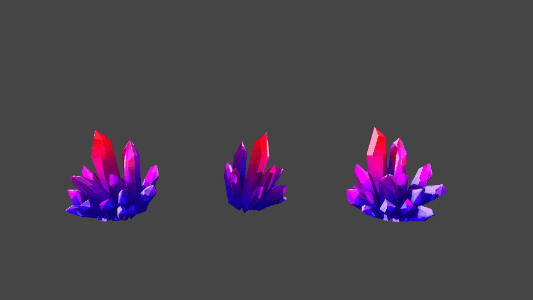
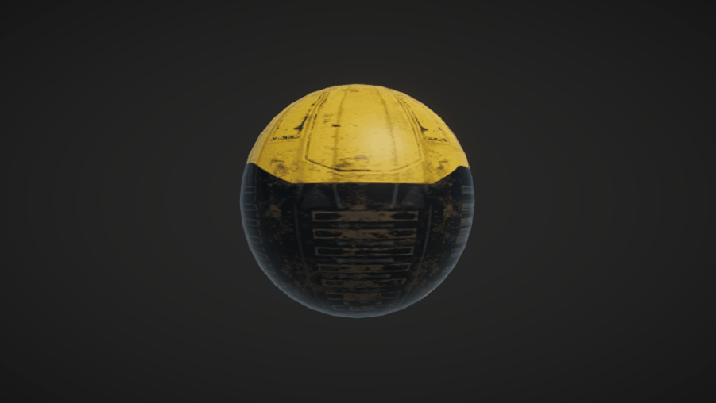
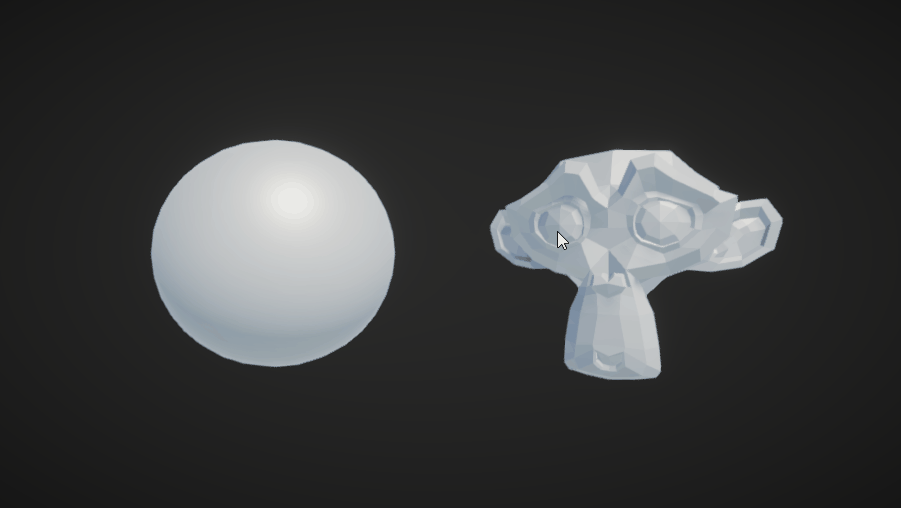
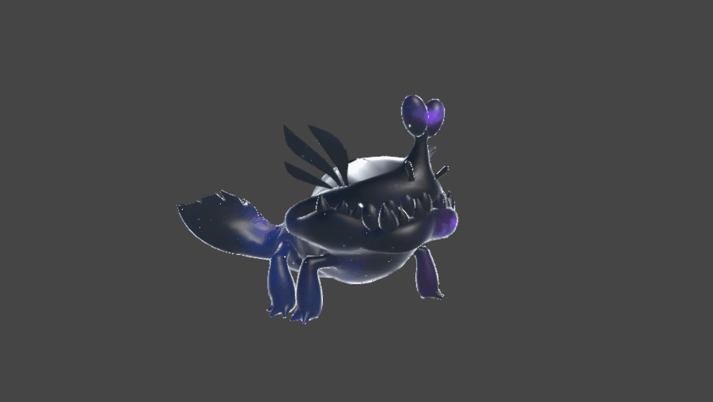

# UniversalRP - Shaders (Shader graph and hand-written)

This repository contains a collection of shaders created by using Shader graph and some of them, hand-written using HLSL.
The shaders implemented here are based on different tutorials, videos and documents, in which multiple developers have shared their knowledge.
So, the main purpose of this project is to implement multiple shaders with the knowledge acquired and put into practice my knowledge of computer graphics using the tools provided by Universal RP.

###### Current support: Unity 2021.3.10f1 with UniversalRP 12.1.7

**Usage of the project**
* Clone the repository or download the zip to use this project locally.
* Load the project using Unity 2021.3.10f1 or later.
* Each scene (located at Scenes folder) contains a different effect samples.

# Examples
Below are shown the examples developed on this repository.

## Transformations (Translate, Rotate and Scale):

## Dissolve:

## Vertex displacement (bounce effect):

## Clipping effect:

## Hologram:

## Toon effect (Shader graph and hand-written):

## Force field:

## Cubemaps:

 # Resources
 * [Stylized Crystal](https://assetstore.unity.com/packages/3d/props/stylized-crystal-77275) by LowPoly.
 * [3D Game Kit - Character Pack](https://assetstore.unity.com/packages/3d/3d-game-kit-props-pack-135218) by Unity Technologies.
 * [3D Game Kit - Props Pack] (https://assetstore.unity.com/packages/3d/3d-game-kit-props-pack-135218) by Unity Technologies.
 * [3D Game Kit](https://assetstore.unity.com/packages/templates/tutorials/3d-game-kit-115747) by Unity Technologies.
 * [Stanford Bunny PBR](https://skfb.ly/otyHx), [Stanford Armadillo PBR](https://skfb.ly/otzQs) [Stanford Dragon PBR](https://skfb.ly/otyzN), and [Utah Teapot PBR] (https://skfb.ly/otAPM) by hackmans.

